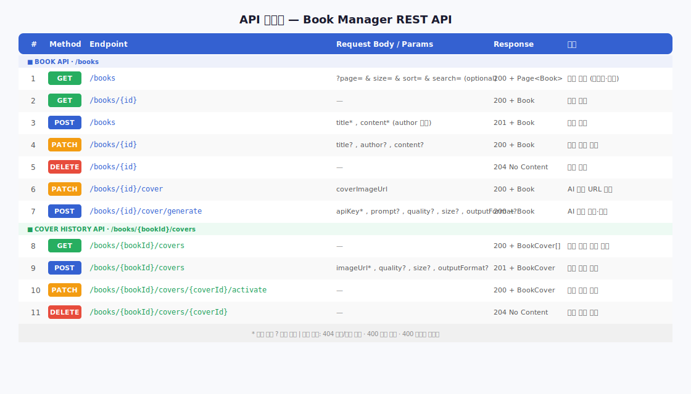
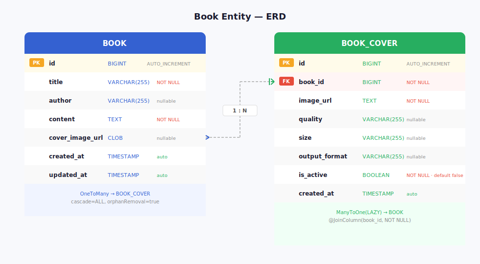

# 도서관리시스템
> AI를 활용한 도서표지 이미지 생성 | KT AIVLE School AI 트랙 미니프로젝트 5차

---

## 기술 스택

| 분류 | 기술 |
|------|------|
| Frontend | React 19, Vite, react-router-dom |
| Backend | Spring Boot 3.2, Spring Data JPA, H2 Database |
| AI | OpenAI API — GPT Image 2 |
| 협업 | GitHub |

---

## 프로젝트 구조

```
4th_miniproject/
├── book-manager/          # Frontend (React + Vite)
│   └── src/
│       ├── components/    # BookCard, BookForm, CoverGenerator 등
│       ├── pages/         # BooksPage, BookDetailPage, BookCreatePage, BookEditPage
│       └── constants/     # API URL 상수
├── book-server/           # Backend (Spring Boot)
│   └── src/main/java/com/aivle/bookapp/
│       ├── domain/        # Book, BookCover Entity
│       ├── repository/    # BookRepository, BookCoverRepository
│       ├── service/       # BookService, BookCoverService (@Transactional)
│       ├── controller/    # BookController, BookCoverController (REST API)
│       ├── dto/           # BookCoverRequest, BookCoverResponse 등
│       ├── exception/     # BookNotFoundException, BookCoverNotFoundException, GlobalExceptionHandler
│       └── config/        # WebConfig (CORS)
└── docs/
    ├── erd.svg            # Book / BookCover ERD
    └── api_spec.svg       # API 명세서
```

---

## 실행 방법

> **터미널 2개** 필요 (Frontend / Backend 각각)

### Backend 실행

```bash
# IntelliJ에서 book-server/ 폴더 열기
# BookappApplication.java → Run
```

또는 Maven으로 직접 실행:

```bash
cd book-server
./mvnw spring-boot:run
```

→ `http://localhost:8080` 기동 확인  
→ H2 콘솔: `http://localhost:8080/h2-console` (JDBC URL: `jdbc:h2:file:./data/bookdb`, 비밀번호 없음)

### Frontend 실행

> ⚠️ Windows PowerShell 최초 1회 설정 (관리자 권한)
> ```powershell
> Set-ExecutionPolicy -ExecutionPolicy RemoteSigned -Scope CurrentUser
> ```

```bash
cd book-manager
npm install
npm run dev
```

→ `http://localhost:5173` 접속

---

## API 명세서



### Book API

| # | Method | Endpoint | Request Body / Params | Response | 설명 |
|---|--------|----------|-----------------------|----------|------|
| 1 | GET | /books | ?page=&size=&sort=&search= (optional) | 200 + Page\<Book\> | 목록 조회 (페이지네이션·검색) |
| 2 | GET | /books/{id} | — | 200 + Book | 상세 조회 |
| 3 | POST | /books | title*, content* (author 선택) | 201 + Book | 도서 등록 |
| 4 | PATCH | /books/{id} | title?, author?, content? | 200 + Book | 도서 부분 수정 |
| 5 | DELETE | /books/{id} | — | 204 No Content | 도서 삭제 |
| 6 | PATCH | /books/{id}/cover | coverImageUrl | 200 + Book | AI 표지 URL 저장 |
| 7 | POST | /books/{id}/cover/generate | apiKey*, prompt?, quality?, size?, outputFormat? | 200 + Book | AI 표지 생성·저장 |

### Cover History API

| # | Method | Endpoint | Request Body | Response | 설명 |
|---|--------|----------|--------------|----------|------|
| 8 | GET | /books/{bookId}/covers | — | 200 + BookCover[] | 표지 이력 목록 조회 |
| 9 | POST | /books/{bookId}/covers | imageUrl*, quality?, size?, outputFormat? | 201 + BookCover | 표지 이력 저장 |
| 10 | PATCH | /books/{bookId}/covers/{coverId}/activate | — | 200 + BookCover | 대표 표지 지정 |
| 11 | DELETE | /books/{bookId}/covers/{coverId} | — | 204 No Content | 표지 이력 삭제 |

> \* 필수 필드  ? 선택 필드  
> 오류 응답: `404` 도서/표지 없음 · `400` 검증 실패 · `400` 소유권 불일치

---

## ERD



### BOOK

| 필드 | 타입 | 제약 |
|------|------|------|
| id | BIGINT | PK, AUTO_INCREMENT |
| title | VARCHAR(255) | NOT NULL |
| author | VARCHAR(255) | nullable |
| content | TEXT | NOT NULL |
| cover_image_url | CLOB | nullable |
| created_at | TIMESTAMP | auto (@CreationTimestamp) |
| updated_at | TIMESTAMP | auto (@UpdateTimestamp) |

### BOOK_COVER

| 필드 | 타입 | 제약 |
|------|------|------|
| id | BIGINT | PK, AUTO_INCREMENT |
| book_id | BIGINT | FK → BOOK.id, NOT NULL |
| image_url | TEXT | NOT NULL |
| quality | VARCHAR(255) | nullable |
| size | VARCHAR(255) | nullable |
| output_format | VARCHAR(255) | nullable |
| is_active | BOOLEAN | NOT NULL, default false |
| created_at | TIMESTAMP | auto (@CreationTimestamp) |

> BOOK : BOOK_COVER = 1 : N (cascade=ALL, orphanRemoval=true)

---

## AI 표지 생성 흐름

```
React → POST /books/{id}/cover/generate (Backend 프록시)
      → Backend → OpenAI API 호출
      → b64_json 응답 → Data URL 변환
      → Book.coverImageUrl 저장 + BookCover 이력 저장
```

1. 도서 상세 페이지 → **AI 표지 생성** 패널 열기
2. OpenAI API Key 입력
3. 품질 / 크기 옵션 선택 → **✨ AI 표지 생성** 클릭
4. 미리보기 확인 후 **💾 이 표지로 저장** 클릭
5. 표지 이력에서 이전 표지 조회 및 대표 표지 변경 가능

> ⚠️ API Key는 소스코드에 하드코딩하거나 GitHub에 업로드하지 마세요.  
> `.env.local`에 `VITE_OPENAI_API_KEY=sk-...` 형태로 설정 가능합니다.
