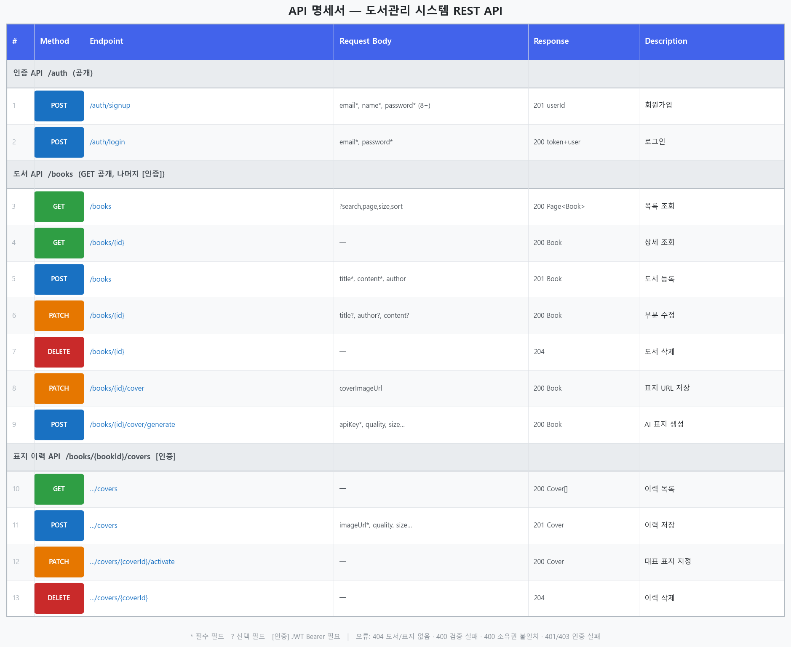
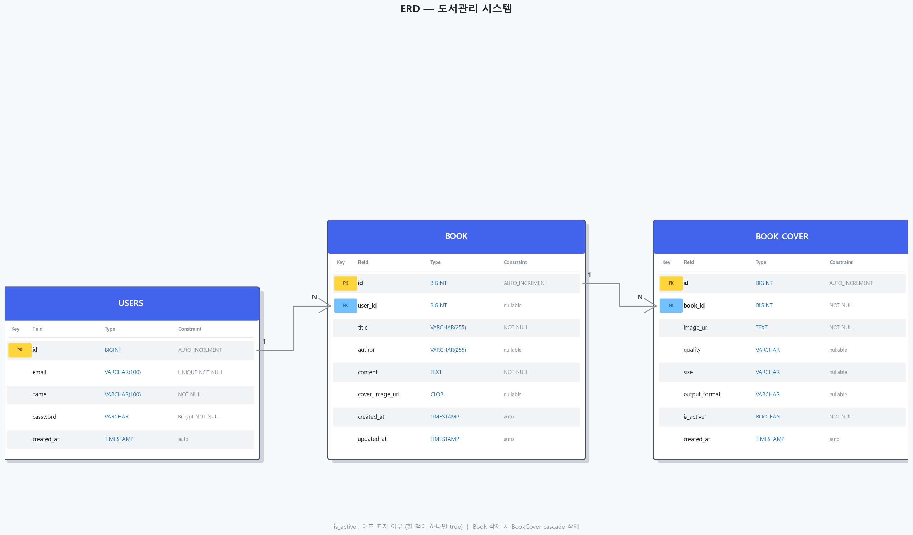

# 도서관리시스템
> AI를 활용한 도서표지 이미지 생성 | KT AIVLE School AI 트랙 미니프로젝트 5차

---

## 팀원 및 R&R

| 이름 | GitHub | 역할 | 주요 기여 |
|------|--------|------|-----------|
| 박종완 | [@Parkjoungwan](https://github.com/Parkjoungwan) | 조장 · PM · 풀스택 | Spring Boot 백엔드 초기 구현, DTO 리팩토링, 서버사이드 검색(프론트+백), AI 표지 백엔드 프록시, 표지 이력 백엔드, 다중 삭제 버그 수정, gitignore 정리, 전체 PR 머지 관리, README·ERD·API 명세서 문서화 |
| 김정욱 | [@JeongUk00](https://github.com/JeongUk00) | 프론트 · 로그인 | 로그인·JWT 인증 전체 구현(feat/login), JWT 시크릿 환경변수 분리, 페이지네이션 프론트 구현, 입력 검증(수정 중 이탈 경고·글자 수 제한) |
| 김영진 | [@OMG4325](https://github.com/OMG4325) | 프론트 · 백엔드 | CoverGenerator 초기 구현, UX 개선(userPrompt·CSS), 소유권 검증 버그 수정, 표지 이력 입력 제한 UX |
| 권수민 | [@sumin55](https://github.com/sumin55) | 프론트 | 다중 선택 삭제 기능, 수정 완료 알림, 도서 폼 검증·취소 버튼 오류 수정, 삭제 후 페이지네이션 갱신 버그 수정 |
| 김수린 | [@surinrtf](https://github.com/surinrtf) | 프론트 | 표지 이력 갤러리 프론트 전체 구현(feat/cover-history-frontend), 표지 생성·저장 모달 UI |
| 고건호 | [@kkh921214](https://github.com/kkh921214) | 백엔드 · 서기 · 문서 | 백엔드 전역 예외 처리 구현(`GlobalExceptionHandler`·`BookNotFoundException`·`ErrorResponse`), `BookForm.jsx` 버튼 UI, PR 리뷰, 회의록·발표 자료 작업 |
| 김주아 | [@gef525](https://github.com/gef525) | 백엔드 | H2 DB 영속화 설정, Jackson 날짜 직렬화, 수정 페이지 표지 이미지 표시 |

---

## 기술 스택

| 분류 | 기술 |
|------|------|
| Frontend | React 19, Vite, react-router-dom |
| Backend | Spring Boot 3.2, Spring Data JPA, Spring Security (JWT) |
| DB | H2 (in-memory) |
| AI | OpenAI API — GPT Image 2 |
| 협업 | GitHub |

---

## 프로젝트 구조

```
4th_miniproject/
├── book-manager/          # Frontend (React + Vite)
│   └── src/
│       ├── components/    # BookCard, BookForm, CoverGenerator, ProtectedRoute
│       ├── pages/         # BooksPage, BookDetailPage, BookCreatePage, BookEditPage
│       │                  # LoginPage, SignupPage
│       └── utils/         # authFetch (JWT 자동 첨부 + 401 리다이렉트)
├── book-server/           # Backend (Spring Boot)
│   └── src/main/java/com/aivle/bookapp/
│       ├── domain/        # Book, BookCover, User 엔티티
│       ├── repository/    # BookRepository, BookCoverRepository, UserRepository
│       ├── service/       # BookService, BookCoverService, AuthService
│       ├── controller/    # BookController, BookCoverController, AuthController
│       ├── config/        # SecurityConfig, JwtTokenProvider, WebConfig
│       └── exception/     # GlobalExceptionHandler
└── docs/
    ├── erd.png            # ERD (3개 테이블)
    └── api_spec.png       # API 명세서 (13개 엔드포인트)
```

---

## 실행 방법

> **터미널 2개** 필요 (Frontend / Backend 각각)

### Backend 실행

**1. JWT 시크릿 파일 생성 (최초 1회, 팀원 각자)**

```
book-server/config/application-secret.yml   ← gitignore 처리됨, 로컬에만 보관
```

```yaml
jwt:
  secret: <256-bit 이상 랜덤 문자열>
  expiration-ms: 86400000
```

**2. 서버 기동**

```bash
cd book-server
./mvnw spring-boot:run
```

→ `http://localhost:8080` 기동 확인  
→ H2 콘솔: `http://localhost:8080/h2-console` (JDBC URL: `jdbc:h2:mem:bookdb`, 비밀번호 없음)

### Frontend 실행

> ⚠️ Windows PowerShell 최초 1회 설정 (관리자 권한)
> ```powershell
> Set-ExecutionPolicy -ExecutionPolicy RemoteSigned -Scope CurrentUser
> ```

```bash
cd book-manager
npm install
npm run dev
```

→ `http://localhost:5173` 접속 → 로그인 후 사용

---

## API 명세서



> 오류 응답 공통 형식: `{ status, message, errors }`  
> - `404` 도서·표지 없음  
> - `400` 검증 실패 (errors 맵에 필드별 사유 포함)  
> - `400` 소유권 불일치 (다른 사용자의 도서·표지 수정·삭제 시도)  
> - `401 / 403` 인증 실패 (토큰 없음 또는 만료)

---

## ERD



> `book.user_id` → `users.id` : 작성자 연결 (nullable — 미로그인 등록 데이터 허용)  
> `book_cover.book_id` → `book.id` : Book 삭제 시 BookCover cascade 삭제  
> `is_active` : 대표 표지 여부, 한 책에 하나만 `true`

---

## AI 표지 생성 흐름

```
React → POST /books/{id}/cover/generate (JWT 포함)
      → 백엔드가 OpenAI API 호출 (title·author·content로 프롬프트 구성)
      → b64_json 응답 → CLOB으로 DB 저장 + BookCover 이력 추가
```

1. 도서 상세 페이지 → **AI 표지 생성** 패널 열기
2. OpenAI API Key 입력
3. 품질 / 크기 / 포맷 옵션 선택 → **✨ AI 표지 생성** 클릭
4. 미리보기 확인 후 **💾 이력에 저장** 클릭

> ⚠️ API Key는 소스코드에 하드코딩하거나 GitHub에 업로드하지 마세요.
